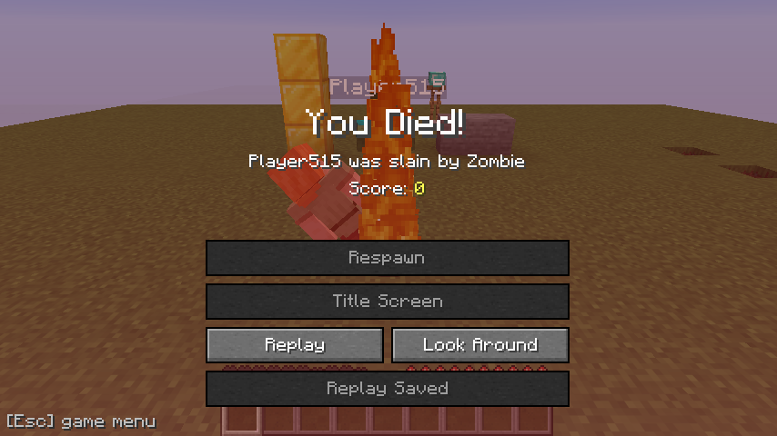
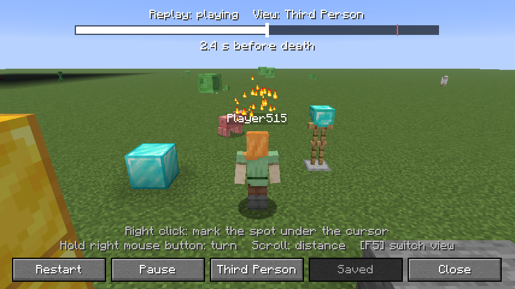
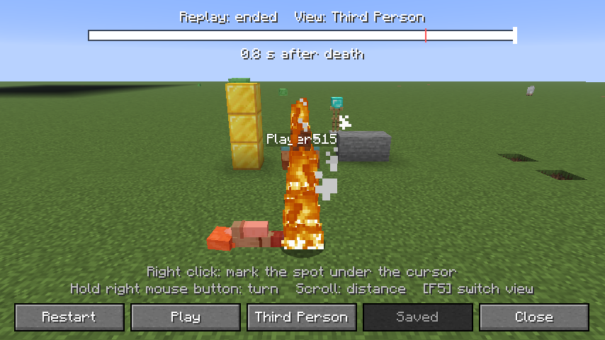
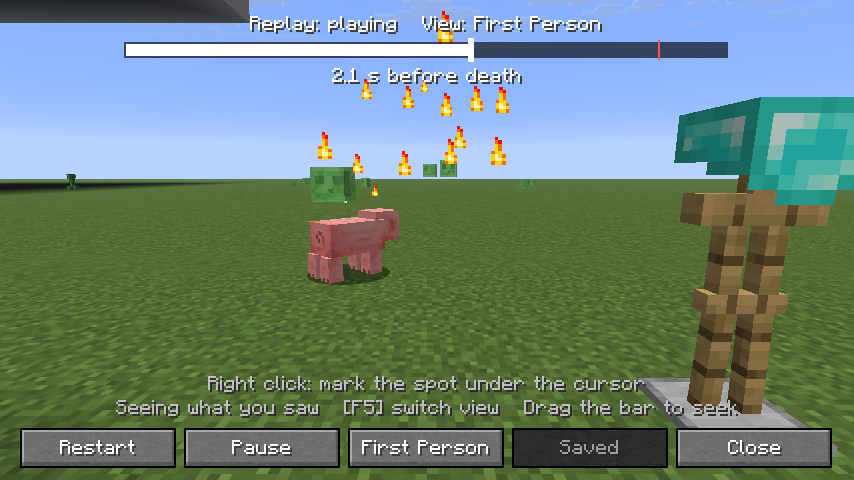
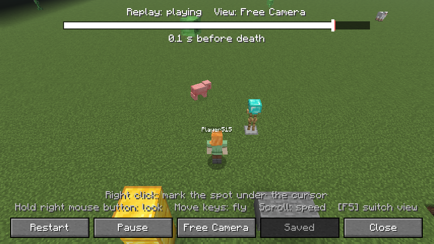
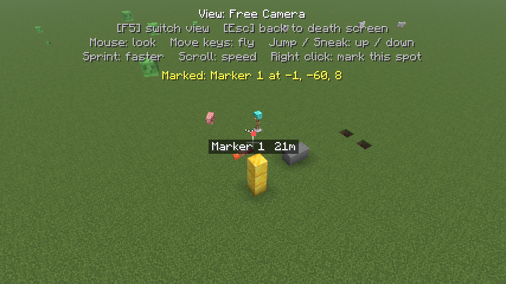
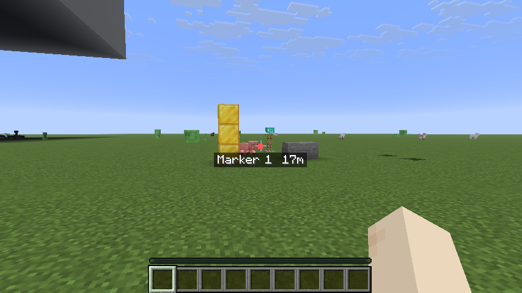
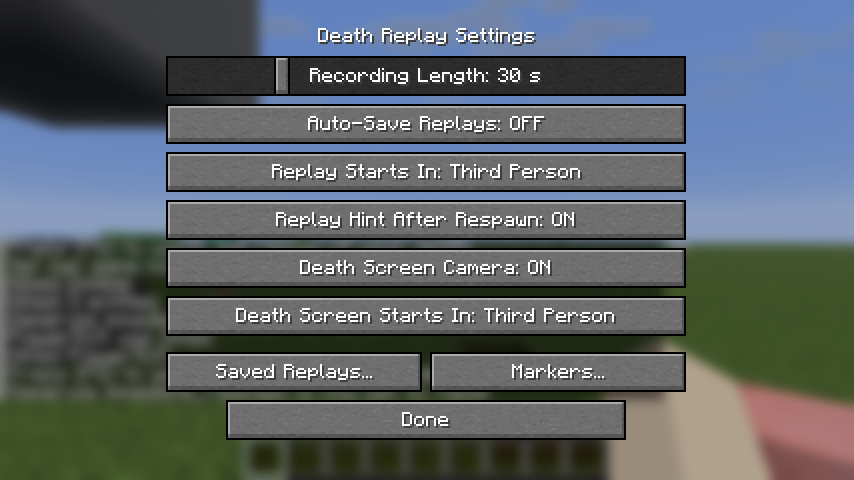

<h1 align="center">Death Replay</h1>

Find out how you died: rewatch the last seconds before your death, and look around freely on the death screen.

看清自己是怎么死的：回看死前的最后几秒，还能在死亡界面自由转动镜头查看现场。

<a href="#english">English</a> · <a href="#简体中文">简体中文</a>

   

# English

**In short**

- Rewatch the last seconds before you died, from any angle.
- The death screen camera lets you look around freely.
- Save replays and watch them again later (F6).
- Client-side only; your world is never changed.

Everything else is in the folded sections below (features, how to use, settings, FAQ): click a title to open it.

Death Replay is a client-side Fabric mod. While you play, it keeps a short rolling recording of what happens around you. When you die, you can watch those last seconds again from any angle, save them to a file, and drop markers, for example where your items fell. It only uses what the server already sends to your game, and it sends nothing back.

<b>Features</b> (click to open)

### Death replay

- **Always-on short recording.** While you are alive, the last 30 seconds are kept in memory (adjustable from 5 to 120 seconds). The mod records data, not video, and only what the server already sends to your game.
- **What you see in a replay.** You, with your skin and armor, plus the mobs, players, animals, dropped items and projectiles within 64 blocks of you. Blocks being placed and broken, particles, sounds, explosions, hurt flashes, critical hit sparks and burning entities appear at the moment they happened.
- **Three views.** Third Person follows you (the default), First Person shows what you saw at the time, and Free Camera lets you fly anywhere, through walls.
- **Playback controls.** Play, pause, restart, jump two seconds back or forward, or click and drag the timeline. A red line marks the moment of death, and a label tells you how many seconds before or after the death you are.
- **On the death screen or later.** Click Replay on the death screen, or press F6 after respawning. The latest replay stays available until your next death or until you leave the world or server, even if you have changed dimension since.
- **Your world is never touched.** A replay plays in a separate copy of the terrain. When you close it, you are back in the real world exactly as it is now.
- **Terrain along your whole route.** The copy covers the path you took during the recording, not only the place where you died. A replay that starts far away, after an elytra flight or a teleport, still has ground under it.
- **Save replays to files.** Use Save Replay on the death screen, Save in the replay, or turn on auto-save. Saved replays can be watched later from the Saved Replays list, even after restarting the game.

### Death screen camera

- **The camera leaves your body.** When you die, the camera moves behind and above your body, so you watch yourself fall instead of getting the tilted view through your body's eyes.
- **Look Around.** A new button on the death screen gives you a clear view: the red overlay, the buttons, the hotbar and the chat are hidden, and the mouse turns the camera. Press F5 to switch between Third Person (turn around your body), Orbit (the camera circles slowly by itself) and Free Camera (fly through walls, with no distance limit).
- **A frozen scene instead of an empty one.** About one second after you die, a vanilla server stops sending you the mobs and players around you, and the normal death screen goes empty. Death Replay shows the last recorded moment frozen in place instead: your body, the mob that killed you and the creatures nearby, until you respawn. If a server keeps sending them, you keep the live view.
- **Caves are visible from inside rock.** When the free camera is inside solid stone, the caves and hollow spaces around it are drawn, like in spectator mode.
- **Game menu without respawning.** Esc on the death screen opens the normal game menu, so you can reach Options or Mod Menu, or quit, without respawning. Closing the menu brings back the same death screen, death message included.

### Markers

- **Mark a spot.** Right-click while looking around to mark what the crosshair points at, or quickly right-click in a replay to mark the spot under the cursor. Useful for remembering where your items dropped or where an attacker came from.
- **Find it after respawning.** When a marked spot is on screen, a red dot with its name and distance appears there, even through walls. Markers also show up as dots on vanilla's locator bar above the hotbar, which helps you turn towards them.
- **Kept per world, only on your computer.** Markers are saved per server address or per single-player world and are still there after a restart. They are never sent to the server. Delete them from the Markers list.

### What it does not do

- **It sends nothing.** Death Replay itself sends no packets to the server and registers no network channels. It does not change gameplay or press any keys for you.
- **Nothing live after respawning.** The moment you respawn, the camera is back on your player. After that, all you can watch is the recording, which ends 0.75 seconds after your death (or at the moment you respawn, if that comes first).
- **Respawning works exactly as in vanilla.** The mod never delays or holds back your respawn.

## Screenshots

The death screen: the zombie that killed you stays frozen in place, with the new Replay, Look Around and save buttons.

Watching a replay in third person: placed blocks, particles and nearby mobs appear as they did at the time.

The end of a replay, just after the death. The red line on the timeline marks the moment you died.

First person: what you saw at the time.

Free camera: fly anywhere while the replay plays.

Look Around in Free Camera on the death screen. A right click dropped a marker.

After respawning, the marker shows its name and distance. The bar above the hotbar is the locator bar, which points to your markers.

The settings screen with its default values.

<b>How to use</b> (click to open)

### Keys

| Action | Default key | Where to change it |
|---|---|---|
| Watch Death Replay (after respawning) | F6 | Options → Controls → Key Binds → Death Replay |
| Open Settings | Not bound | Options → Controls → Key Binds → Death Replay |
| Marker List | Not bound | Options → Controls → Key Binds → Death Replay |
| Switch view (Look Around and replays) | F5 (your Toggle Perspective key) | Options → Controls → Key Binds |
| Fly the free camera | W / A / S / D (your movement keys) | Options → Controls → Key Binds |
| Fly up / down | Space / Left Shift (your Jump / Sneak keys) | Options → Controls → Key Binds |
| Fly 2.5 times faster | Left Ctrl (your Sprint key) | Options → Controls → Key Binds |

The camera keys follow whatever you have bound in the vanilla controls. F6 only works when no screen is open; on the death screen, use the Replay button. If there is no death in memory, F6 opens the Saved Replays list instead.

**In a replay**

| Action | Key or mouse |
|---|---|
| Play / pause | Enter |
| Back / forward 2 seconds | Left / Right arrow |
| Restart | R |
| Switch view (Third Person → Free Camera → First Person) | F5 |
| Turn the camera | Hold the right mouse button and move the mouse |
| Drop a marker on the spot under the cursor | Quick right click, without dragging |
| Jump to a moment | Click or drag on the timeline |
| Camera distance (Third Person) / flight speed (Free Camera) | Mouse wheel |
| Close | Esc |

The buttons at the bottom do the same: Restart, Play / Pause, the current view (click to switch), Save and Close. Dragging the timeline pauses playback; if it was playing, it continues when you let go. Pressing Play at the end starts the replay again from the beginning.

**While looking around (death screen)**

| Action | Key or mouse |
|---|---|
| Turn the camera | Move the mouse |
| Switch view (Third Person → Orbit → Free Camera) | F5 |
| Camera distance (1.5 to 20 blocks) / flight speed (2 to 40 blocks per second) | Mouse wheel |
| Drop a marker where the crosshair points | Right click |
| Back to the death screen | Esc |

**On the death screen:** Esc opens the game menu.

### Commands

Death Replay has no commands.

### Settings screen

- **With Mod Menu:** Mods → Death Replay → the settings icon. From the death screen you get there through Esc → Mods.
- **Without Mod Menu:** bind a key to **Open Settings** under Options → Controls → Key Binds → Death Replay.

### Step by step

**See how you died**

1. Die. The camera moves behind your body, and a moment later the scene freezes in place.
2. Wait a moment until the **Replay** button lights up, then click it.
3. Drag the timeline, switch views with F5, and press Esc to go back to the death screen.

**Watch it again after respawning**

1. Respawn. A chat line reminds you which key plays the replay.
2. Press **F6**. Find a safe spot first: the game keeps running while you watch.

**Keep a replay**

1. Click **Save Replay** on the death screen, or **Save** in the replay. The chat shows the file name.
2. Later, join any world, open the settings, click **Saved Replays...** and pick the file. (If there is no death in memory, F6 opens the same list.)

**Mark where your items are**

1. On the death screen, click **Look Around** and press F5 until you are in Free Camera.
2. Fly to the spot, aim the crosshair at it and right-click.
3. Respawn and follow the label and the locator bar. When you are done, delete the marker in the Markers list.

### Good to know

- The game is not paused while you watch. If you watch after respawning, your character stays where it is and can be attacked; dying closes the replay.
- A replay ends when you respawn, change dimension or leave the world.
- Saved replays go to the `deathreplay` folder in your game directory (next to `mods` and `saves`), named after the date and time of the death, for example `death_2026-10-01_17-10-13.nbt`. The **Folder** button in the Saved Replays list opens it. Most of a file is terrain, so its size depends on where you were (about 50 KB on a superflat world, more on normal terrain).
- A saved file contains the terrain along your route, your coordinates and the names of players near you. Keep that in mind before sharing one.
- The Saved Replays list shows the latest death still in memory at the top, then your saved files, newest first.
- A marker lands on the surface of the block you aim at, up to 256 blocks away; if there is nothing in that direction, it is placed where the camera is. Markers are named automatically (Marker 1, Marker 2, ...) and only show in the dimension they belong to.
- Settings are stored in `config/deathreplay.json`, markers in `config/deathreplay-waypoints.json`.

<b>Settings</b> (click to open)

| Option (as shown in game) | Default | What it does |
|---|---|---|
| Recording Length | 30 s | How many seconds before your death are kept, from 5 to 120 in steps of 5. Longer uses more memory. |
| Auto-Save Replays | OFF | Saves every death replay to the `deathreplay` folder automatically. When off, use the Save Replay button. |
| Replay Starts In | Third Person | The view a replay opens with: First Person, Third Person or Free Camera. You can still switch while it plays. |
| Replay Hint After Respawn | ON | After you respawn, a chat line tells you which key plays the replay. |
| Death Screen Camera | ON | Moves the camera off your body on the death screen, adds the Look Around button and shows the frozen scene. When off, the death screen view is vanilla; the Replay and Save Replay buttons stay. |
| Death Screen Starts In | Third Person | The view the death screen opens with: Third Person, Orbit or Free Camera. |

The settings screen also has **Saved Replays...** and **Markers...** buttons. Hover over an option to see a short explanation. Changes apply immediately and are saved when you close the screen.

## Requirements

| | |
|---|---|
| Minecraft | Java Edition 1.21.11 or 26.1–26.2 (each has its own jar; 26.x needs Java 25) |
| Mod loader | Fabric Loader 0.19.5 or newer |
| Fabric API | Required |
| Java | 21 or newer |
| Mod Menu | Optional: adds a settings button to the mod list |

Death Replay is client-side only. Install it in your own game; servers do not need it.

<b>Compatibility</b> (click to open)

- **Sodium:** works. Tested with Sodium 0.8.7.
- **Iris and shader packs:** not tested yet. Reports are welcome.
- **Voxy:** not tested yet.
- **Multiplayer servers:** nothing needs to be installed on the server, since the mod only uses what your game already receives. It has not been tested on a multiplayer server yet.
- **Server rules:** the Look Around free camera passes through blocks and has no distance limit, so it can show any terrain your game has loaded. It is only available while you are dead, and the mobs you see then are the frozen past. Whether a death screen camera is allowed is up to each server.
- **ERTZ Death Replay:** a different mod with the same name. Both change the death screen, so this mod declares it incompatible (its mod ID is `deathreplay`); install only one of the two.
- **Replays with modded content:** a saved replay that contains blocks or mobs from other mods may not open where those mods are missing. You get a message, not a crash.

## Installation

1. Install Fabric Loader 0.19.5 or newer for your Minecraft version.
2. Download Fabric API for that version and put it in your `mods` folder.
3. Put the Death Replay jar for your Minecraft version (from the [releases](https://github.com/Autyism/DeathReplay/releases)) in the same `mods` folder.
4. Optional: add Mod Menu to open the settings from the mod list.
5. Start the game with the Fabric profile.

<b>FAQ</b> (click to open)

**Does it send anything to the server? Is it allowed?**
Death Replay itself sends nothing to the server and registers no network channels; it only replays what your game already received. Whether a death screen free camera is allowed is decided by each server's rules.

**The Replay button is grey.**
It lights up a moment after you die, once the recording is finished.

**F6 does nothing.**
F6 only works when no screen is open. On the death screen, use the Replay button. Also check Key Binds for another mod using F6.

**F6 opens a list instead of a replay.**
There is no death in memory, for example right after starting the game or after joining another world. Pick a saved replay from the list.

**Parts of the replay are empty.**
A replay only contains the terrain along your route (8 chunks around the place of death and 6 around the rest of the route, never more than your render distance) and the entities within 64 blocks of you. Beyond that, the free camera shows empty space.

**The mobs on the death screen do not move.**
That is the frozen last moment. Click Replay to see what happened.

**My experience bar turned into a bar with a dot.**
That is vanilla's locator bar, showing your markers. Delete the markers to get the experience bar back. Your level number is still shown.

**I want the vanilla death screen back.**
Turn off **Death Screen Camera** in the settings.

**The chat hint after respawning bothers me.**
Turn off **Replay Hint After Respawn** in the settings.

**A saved replay says "Could not read".**
It was saved by another Minecraft version, the file is damaged, or it contains content from mods you do not have.

**Does it cost performance?**
It records data, not video. Measured on a flat world, recording took about 0.02 ms per game tick on average with about 30 entities nearby and about 0.07 ms with about 180 (a game tick lasts 50 ms). At the moment of death it copies the terrain once, which took about 3 ms on a flat world; busier terrain takes longer. Opening and closing a replay rebuilds the chunk display once, similar to pressing F3 + A.

<b>Known limitations</b> (click to open)

- Replays play at normal speed only; there is no slow motion or fast-forward.
- First-person replays do not show your hand or the item you were holding.
- Sounds of your own actions that your game plays by itself, such as your footsteps and swings, are not in the replay, because the server never sends them to you. Sounds from other players, mobs and blocks are.
- Fishing bobbers are not shown in replays.
- Signs and other blocks with stored content that were broken during the recording come back without their content, for example a sign without its text.
- The recording starts over when you change dimension: if you went through a portal shortly before dying, the replay starts when you arrived.
- Up to 512 entities are recorded per tick; in very crowded places, such as mob farms, the rest are left out.
- With the "Respawn immediately" game rule there is no death screen, so Look Around and the death screen buttons are not available. The death is still recorded: press F6 after respawning (the recording then ends at the moment you respawned).
- A quick right click in a replay always drops a marker, even if you only meant to turn the camera. Delete extra markers in the Markers list.
- Markers stay until you delete them, even after you reach them.
- While you have markers in your current dimension, the locator bar replaces the experience bar.
- The latest recording is kept in memory only until your next death or until you leave the world or server. Save it to keep it.
- Replays can only be watched while you are in a world, and saved files only open in the Minecraft version they were saved with.

## Credits

Death Replay is an original mod written from scratch by Autyism; it is not based on another mod. It is built on Fabric and Fabric API and has an optional Mod Menu integration.

Source code and issue tracker: [github.com/Autyism/DeathReplay](https://github.com/Autyism/DeathReplay) · [Issues](https://github.com/Autyism/DeathReplay/issues)

## License

`GPL-3.0-only`. Death Replay is licensed under the GNU General Public License v3.0: you may use, change and share it, and any version you distribute must also be released under the GPL. See [LICENSE](LICENSE).

# 简体中文

**一句话看懂**

- 回看死前的最后几秒，任意角度。
- 死亡界面可以自由转动视角四处看。
- 回放能保存，之后按 F6 再看。
- 纯客户端，不会改动你的世界。

详细说明都在下面折叠起来的部分（功能、使用方法、设置、常见问题），点标题就能展开。

**Death Replay（死亡回放）**

Death Replay 是一个纯客户端的 Fabric 模组。你在玩的时候，它会一直滚动记录身边最近发生的事。死了以后，你可以从任意角度把这几秒重新看一遍、保存成文件，还可以在现场留下标记（比如东西掉在哪）。它只用服务器本来就发给你的数据，不向服务器发送任何东西。

<b>功能</b>（点开查看）

### 死前回放

- **一直在录，只存在内存里。** 活着的时候，模组会在内存里保留最近 30 秒（可在 5～120 秒之间调整）。录的是数据而不是视频，而且只录服务器本来就发给你的东西。
- **回放里能看到什么。** 你自己（带皮肤和盔甲），以及你周围 64 格内的怪物、玩家、动物、掉落物和弹射物。方块的放置与破坏、粒子、声音、爆炸、受伤变红、暴击粒子、着火，都会在当时的那一刻重现。
- **三种视角。** 第三人称跟着你（默认）；第一人称就是你当时看到的画面；自由视角可以随便飞，还能穿墙。
- **播放控制。** 播放、暂停、从头播放、后退或前进 2 秒，也可以点击或拖动进度条。进度条上的红色竖线标出死亡时刻，下方的文字显示当前是"死亡前 / 死亡后多少秒"。
- **死亡界面能看，重生后也能看。** 在死亡界面点"回放"，或者重生后按 F6。最近一次的回放会一直保留到下一次死亡、或者你退出这个世界 / 服务器为止，中途换了维度也照样能看。
- **不碰真实世界。** 回放是在一份单独的地形副本里播放的。关掉回放，眼前就是世界现在的真实样子。
- **整条路线的地形都在。** 地形副本覆盖录像期间你走过的整条路线，而不只是死亡点附近。就算回放开头你还在很远的地方（比如刚用鞘翅飞过来，或者刚被传送过来），脚下也有地形。
- **保存成文件。** 在死亡界面点"保存回放"、在回放里点"保存"，或者打开自动保存。保存好的回放之后可以在"已保存的回放"列表里观看，重启游戏也没问题。

### 死亡界面自由视角

- **镜头离开尸体。** 死亡时镜头会退到你身后上方，让你看着自己倒下，而不是原版那种从尸体眼睛看出去、歪向一边的画面。
- **观察战场。** 点死亡界面上新增的"观察战场"按钮，画面会变干净：红色滤镜、按钮、快捷栏和聊天栏都会隐藏，用鼠标直接转动镜头。按 F5 在三种视角间切换：第三人称（绕着尸体转着看）、环绕（镜头自己慢慢转圈）、自由视角（可以穿墙，没有距离限制）。
- **定格的现场，而不是一片空地。** 你死亡大约 1 秒后，原版服务器就不再给你发送周围的怪物和玩家，原版死亡界面也就空了。这个模组会把录像的最后一刻定格在原地：你的尸体、打死你的怪、周围的生物，一直保留到你重生。如果服务器在你死后还继续发送它们，就保留实时画面。
- **在石头里也能看到矿洞。** 自由视角钻进实心方块时，周围的洞穴和空腔会像旁观模式一样显示出来。
- **不重生也能打开游戏菜单。** 在死亡界面按 Esc 会打开平常的游戏菜单，不用先重生就能进选项、进 Mod Menu 或者退出。关掉菜单会回到原来的死亡界面，死亡信息还在。

### 标记

- **标记地点。** 在"观察战场"里点鼠标右键，标记屏幕中心准星所指的地方；在回放里快速点一下右键，标记光标所指的地方。适合记住东西掉在哪、敌人是从哪边来的。
- **重生后找回去。** 标记的位置出现在画面里时，那里会显示一个红点和名字、距离，隔着墙也能看到。标记还会以小点的形式显示在快捷栏上方的原版定位栏上，帮你转向它所在的方向。
- **按世界分开保存，只存在你的电脑上。** 标记按服务器地址或单人存档分别保存，重启游戏后还在，也不会发送给服务器。可以在标记列表里删除。

### 它不会做的事

- **不发送任何东西。** 模组本身不向服务器发送任何数据包，也不注册任何网络频道；不改变玩法，也不替你按任何键。
- **重生后看不到实时画面。** 一重生，镜头立刻回到你的角色身上。之后能看的只有录像，录像在死亡后 0.75 秒结束（如果在这之前就重生了，就截止到重生那一刻）。
- **重生和原版完全一样。** 模组从不延迟或拦下你的重生。

## 截图

死亡界面：打死你的僵尸定格在原地，下方是新增的"回放""观察战场"和保存按钮。

第三人称看回放：放下的方块、粒子和周围的生物都按当时的样子重现。

回放结尾，死亡之后的那一刻。进度条上的红线就是你死亡的时刻。

第一人称：你当时看到的画面。

自由视角：回放播放的同时可以随意飞行观察。

在死亡界面的"观察战场"里切到自由视角，点右键留下了一个标记。

重生后，标记会显示名字和距离。快捷栏上方的是定位栏，用来指示标记的方向。

设置界面（均为默认值）。

<b>使用方法</b>（点开查看）

### 按键

| 功能 | 默认按键 | 在哪里修改 |
|---|---|---|
| 观看死亡回放（重生后） | F6 | 选项 → 按键控制 → 按键绑定 → 死亡回放 |
| 打开设置 | 未绑定 | 选项 → 按键控制 → 按键绑定 → 死亡回放 |
| 标记列表 | 未绑定 | 选项 → 按键控制 → 按键绑定 → 死亡回放 |
| 切换视角（观察战场和回放中） | F5（你的"切换视角"键） | 选项 → 按键控制 → 按键绑定 |
| 自由视角飞行 | W / A / S / D（你的移动键） | 选项 → 按键控制 → 按键绑定 |
| 上升 / 下降 | 空格 / 左 Shift（你的"跳跃" / "潜行"键） | 选项 → 按键控制 → 按键绑定 |
| 2.5 倍速飞行 | 左 Ctrl（你的"疾跑"键） | 选项 → 按键控制 → 按键绑定 |

镜头用的都是你在原版按键绑定里设好的键，改了键位它也跟着变。F6 只在没有打开任何界面时有效；在死亡界面上请直接点"回放"按钮。内存里没有死亡录像时，按 F6 会打开"已保存的回放"列表。

**回放中**

| 操作 | 按键 / 鼠标 |
|---|---|
| 播放 / 暂停 | 回车 |
| 后退 / 前进 2 秒 | ← / → |
| 从头播放 | R |
| 切换视角（第三人称 → 自由视角 → 第一人称） | F5 |
| 转动镜头 | 按住鼠标右键并移动鼠标 |
| 在光标所指的地方留标记 | 快速点一下右键（不要拖动） |
| 跳到某一刻 | 点击或拖动进度条 |
| 镜头远近（第三人称）/ 飞行速度（自由视角） | 鼠标滚轮 |
| 关闭回放 | Esc |

底部那排按钮也能做同样的事：从头播放、播放 / 暂停、当前视角（点一下换下一个）、保存、关闭。拖动进度条时会自动暂停；如果之前在播放，松手后会继续播。播到结尾后再点"播放"，会从头再放一遍。

**观察战场时（死亡界面）**

| 操作 | 按键 / 鼠标 |
|---|---|
| 转动镜头 | 直接移动鼠标 |
| 切换视角（第三人称 → 环绕 → 自由视角） | F5 |
| 镜头远近（1.5～20 格）/ 飞行速度（每秒 2～40 格） | 鼠标滚轮 |
| 在准星所指的地方留标记 | 鼠标右键 |
| 返回死亡界面 | Esc |

**死亡界面上：** 按 Esc 打开游戏菜单。

### 命令

这个模组没有任何命令。

### 设置界面

- **装了 Mod Menu：** 模组 → Death Replay → 设置图标。在死亡界面上可以按 Esc → 模组 进去。
- **没装 Mod Menu：** 在 选项 → 按键控制 → 按键绑定 → 死亡回放 里给"打开设置"绑一个键。

### 分步说明

**看看自己是怎么死的**

1. 死亡后，镜头会退到尸体后方，片刻之后现场会定格。
2. 稍等一下，等"回放"按钮亮起后点它。
3. 拖动进度条、按 F5 换视角，看完按 Esc 回到死亡界面。

**重生后再看一遍**

1. 重生后，聊天栏会提示用哪个键看回放。
2. 按 **F6**。最好先找个安全的地方：看回放的时候游戏不会暂停。

**把回放存下来**

1. 在死亡界面点"保存回放"，或在回放里点"保存"。聊天栏会显示文件名。
2. 以后进入任意一个世界，打开设置，点"已保存的回放…"，选择那个文件。（内存里没有死亡录像时，按 F6 也会打开这个列表。）

**标记东西掉落的位置**

1. 在死亡界面点"观察战场"，按 F5 切到自由视角。
2. 飞到目标附近，把准星对准它，点鼠标右键。
3. 重生后跟着屏幕上的标签和定位栏走过去。用完后在标记列表里把它删掉。

### 需要知道的事

- 看回放的时候游戏不会暂停。如果是重生后活着看，你的角色会站在原地，可能会被攻击；被打死时回放会自动关闭。
- 重生、切换维度或退出世界时，正在播放的回放会结束。
- 保存的回放放在游戏目录下的 `deathreplay` 文件夹里（和 `mods`、`saves` 同级），文件名是死亡的日期和时间，例如 `death_2026-10-01_17-10-13.nbt`。"已保存的回放"列表里的"文件夹"按钮可以直接打开它。文件的大部分是地形，所以大小取决于你当时在哪里（超平坦世界大约 50 KB，普通地形会更大）。
- 保存的文件里有你路线上的地形、你的坐标以及附近玩家的名字。分享给别人之前请想一想。
- "已保存的回放"列表最上面是内存里的上次死亡，下面是保存的文件，新的在前。
- 标记会落在你对准的方块表面上，最远 256 格；如果那个方向什么都没有，就放在镜头所在的位置。标记会自动命名（标记 1、标记 2……），只在它所在的维度里显示。
- 设置保存在 `config/deathreplay.json`，标记保存在 `config/deathreplay-waypoints.json`。

<b>设置</b>（点开查看）

| 选项（游戏内名称） | 默认值 | 作用 |
|---|---|---|
| 录制时长 | 30 秒 | 保留死亡前多少秒，5～120 秒，每档 5 秒。越长占用内存越多。 |
| 自动保存回放 | 关 | 每次死亡都自动把回放存进 `deathreplay` 文件夹。关闭时可以用"保存回放"按钮手动保存。 |
| 回放默认视角 | 第三人称 | 打开回放时使用的视角：第一人称、第三人称或自由视角。播放中仍可随时切换。 |
| 重生后提示回放按键 | 开 | 重生后在聊天栏提示按哪个键观看回放。 |
| 死亡界面自由视角 | 开 | 死亡界面上把镜头从尸体上移开，加上"观察战场"按钮，并显示定格的现场。关闭后死亡界面的画面与原版一致，"回放"和"保存回放"按钮仍然保留。 |
| 死亡界面默认视角 | 第三人称 | 死亡界面刚出现时使用的视角：第三人称、环绕或自由视角。 |

设置界面里还有"已保存的回放…"和"标记…"两个按钮。鼠标停在选项上会显示说明。改动立刻生效，关闭设置界面时保存。

## 运行需求

| | |
|---|---|
| Minecraft | Java 版 1.21.11 或 26.1–26.2（每个版本有单独的 jar；26.x 需要 Java 25） |
| 模组加载器 | Fabric Loader 0.19.5 或更高 |
| Fabric API | 必需（前置） |
| Java | 21 或更高 |
| Mod Menu | 可选：在模组列表里加一个设置按钮 |

这是纯客户端模组，只需要装在你自己的游戏里，服务器不需要安装。

<b>兼容性</b>（点开查看）

- **Sodium（钠）：** 可以正常使用，已在 Sodium 0.8.7 下测试。
- **Iris 和光影包：** 尚未测试，欢迎反馈。
- **Voxy：** 尚未测试。
- **多人服务器：** 服务器上不需要安装任何东西，因为模组只使用你的游戏本来就收到的数据。目前还没有在多人服务器上测试过。
- **服务器规则：** "观察战场"的自由视角可以穿墙、没有距离限制，能看到你的游戏已经加载的所有地形。它只在你死亡期间可用，这时看到的生物是定格的过去。服务器是否允许死亡界面自由视角，由各服务器自己决定。
- **ERTZ Death Replay：** 另一个同名模组。两者都会改死亡界面，所以本模组声明与它不兼容（它的模组 ID 是 `deathreplay`），两个只能装一个。
- **含其他模组内容的回放：** 如果保存的回放里有其他模组的方块或生物，在缺少这些模组的地方可能打不开。这时会显示提示，不会崩溃。

## 安装

1. 为你的 Minecraft 版本安装 Fabric Loader 0.19.5 或更高版本。
2. 下载这个版本的 Fabric API，放进 `mods` 文件夹。
3. 把对应你 Minecraft 版本的 Death Replay jar（在 [Releases](https://github.com/Autyism/DeathReplay/releases) 里）放进同一个 `mods` 文件夹。
4. 可选：再装上 Mod Menu，就能从模组列表打开设置。
5. 用 Fabric 版本启动游戏。

<b>常见问题</b>（点开查看）

**它会向服务器发送东西吗？能用吗？**
模组本身不向服务器发送任何东西，也不注册网络频道，只是回放你的游戏已经收到的内容。服务器是否允许死亡界面自由视角，以各服务器的规则为准。

**"回放"按钮是灰的。**
死亡后稍等片刻，录像收尾完成后按钮就会亮起。

**按 F6 没反应。**
F6 只在没有打开任何界面时有效。在死亡界面上请点"回放"按钮。另外检查一下按键绑定里有没有别的模组也占用了 F6。

**按 F6 出来的是一个列表，不是回放。**
内存里没有死亡录像，比如刚启动游戏、或刚进入另一个世界。可以在列表里选一个保存过的回放。

**回放里有些地方是空的。**
回放里只有你路线上的地形（死亡点周围 8 个区块、路线其余部分周围 6 个区块，且不超过你的渲染距离），以及你周围 64 格内的实体。再往外飞就是空的。

**死亡界面上的怪一动不动。**
那是定格的最后一刻。想看它们是怎么动的，点"回放"。

**经验条变成了一条带点的横条。**
那是原版的定位栏，正在显示你的标记。把标记删掉，经验条就回来了。经验等级的数字仍然会显示。

**我想要原版的死亡界面。**
在设置里关掉"死亡界面自由视角"。

**重生后的聊天提示很烦。**
在设置里关掉"重生后提示回放按键"。

**保存的回放提示"无法读取"。**
这个文件是别的 Minecraft 版本保存的、文件已损坏，或者里面有你没安装的模组内容。

**会影响性能吗？**
它录的是数据而不是视频。在超平坦世界里实测：周围约 30 个实体时，录制平均每个游戏刻约 0.02 毫秒；约 180 个实体时约 0.07 毫秒（一个游戏刻是 50 毫秒）。死亡那一刻会复制一次地形，超平坦世界约 3 毫秒，地形复杂时会更久。打开和关闭回放时会重新生成一次区块画面，感觉和按 F3 + A 差不多。

<b>已知限制</b>（点开查看）

- 回放只能以正常速度播放，没有慢放和快进。
- 第一人称回放里看不到自己的手和手持物品。
- 你自己的动作在本地发出的声音（比如你的脚步声、挥手声）不在回放里，因为服务器不会把这些声音发给你。其他玩家、生物和方块的声音都在。
- 回放里不显示钓鱼浮标。
- 告示牌这类带内容的方块，如果是在录像期间被破坏的，回放里会恢复方块，但内容回不来（比如告示牌上没有字）。
- 切换维度时录像会重新开始：如果你在死前不久刚穿过传送门，回放会从你到达时开始。
- 每个游戏刻最多记录 512 个实体；在刷怪塔这类特别拥挤的地方，多出来的不会被录下。
- 开启"立即重生"游戏规则时没有死亡界面，所以"观察战场"和死亡界面上的按钮都用不了。不过这次死亡照样会录下来：重生后按 F6 就能看（录像截止到你重生的那一刻）。
- 在回放里快速点一下右键一定会留下标记，哪怕你只是想转动镜头。多出来的标记可以在标记列表里删掉。
- 标记不会自己消失，走到那里也不会，需要手动删除。
- 当前维度里有标记时，定位栏会代替经验条显示。
- 最近一次的录像只保存在内存里，直到下一次死亡或你退出世界 / 服务器为止。想留着就保存成文件。
- 只有进入世界后才能观看回放；保存的文件只能在保存它的同一个 Minecraft 版本里打开。

## 致谢

Death Replay 是 Autyism 从零编写的原创模组，不是从其他模组改来的。它基于 Fabric 和 Fabric API，并可选支持 Mod Menu。

源代码与问题反馈：[github.com/Autyism/DeathReplay](https://github.com/Autyism/DeathReplay) · [Issues](https://github.com/Autyism/DeathReplay/issues)

## 许可证

`GPL-3.0-only`。Death Replay 以 GNU 通用公共许可证第 3 版（GPL v3）发布：你可以自由使用、修改和分发；分发修改后的版本时，也必须以 GPL 开源。详见 [LICENSE](LICENSE)。
